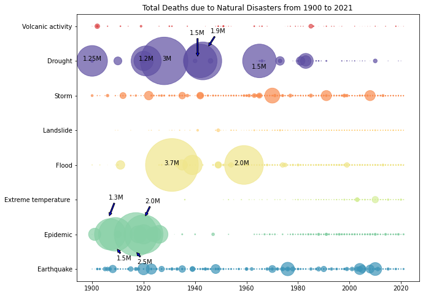

<h1>Exploratory Analysis of Natural Disasters and Public Awareness</h1>

<h2>Team Members</h2>

By Jaya Konda, Pujika Kumar, Gaopo Huang, Jiawei Zheng, Andy Liu

<h2>Problem: </h2>

Can natural disasters increase public awareness of climate change?
Is there any trend in natural disaster incidents and casualties from natural disasters over the years? 
How impactful is the media interest of climate change over the natural disaster incidents?

<h2>Dataset:</h2>

Natural Disaster incident over years ( https://www.kaggle.com/brsdincer/all-natural-disasters-19002021-eosdis). This dataset contains 2 csv files, with each containing 45 columns having information about year, disaster type, country, etc. 

Media (specifically TV news) interest in climate change over years: (https://blog.gdeltproject.org/a-new-dataset-for-exploring-climate-change-narratives-on-television-news-2009-2020/). This data contains 418 csv files, with each containing information about TV news reported on these natural disasters. 

Earth temperature over years (https://www.kaggle.com/berkeleyearth/climate-change-earth-surface-temperature-data?select=GlobalLandTemperaturesByMajorCity.csv) This dataset contains 5 csv files, with each containing temperature data over different regions.

Capital over gdp. This dataset contains columns and 19879 rows

Proposed Solution and Real world Application: 
We aim to explore the correlation between climate change and media interest and sentiment, along with the change of temperature, the number of natural disaster incidents and casualties over years. The solution can be used to extract and visualize information from dataset like natural disaster incidents, the attention of these natural disasters and climate change from media, etc. 
This analysis can be used to get valuable insights such as: if the occurrence of natural disasters increase public awareness of climate change, and whether media interest/public awareness  makes observable impact on the climate change?

Steps

1.Deeper analysis on the datasets found and start reading datasets into pandas.Errors check if data is being read incorrectly.

2.Use mathematical formulas to see if there any relation between earth temperature, nature disasters, and climate awareness. 

3.Visualize the information we find by plots and graphs.

4.Finish up on the codes, test for bugs, and create the ppt.

<h2>Required Packages</h2>

-pandas

-numpy

-matplotlib

-geopandas

-seaborn

